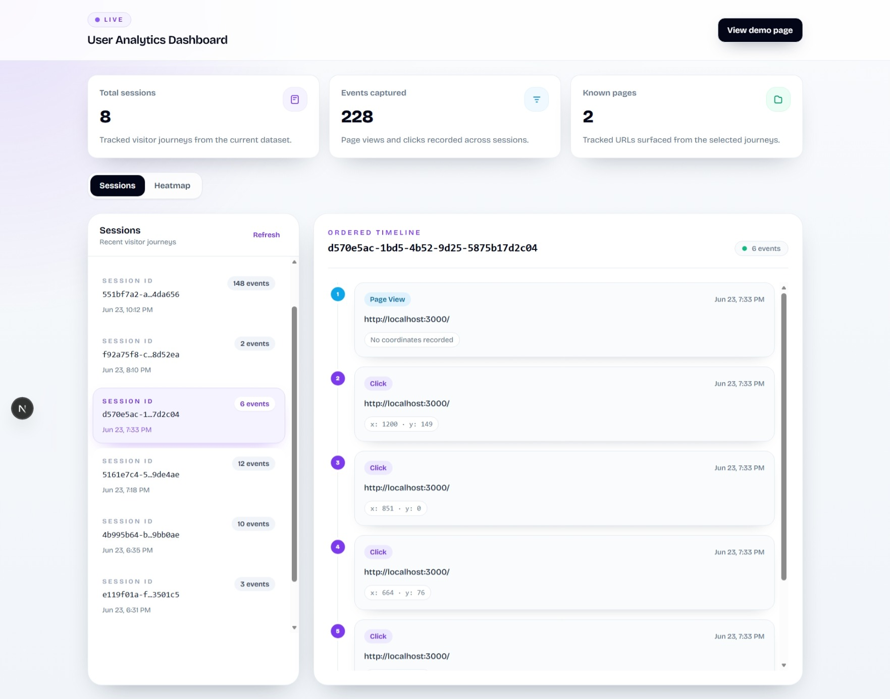
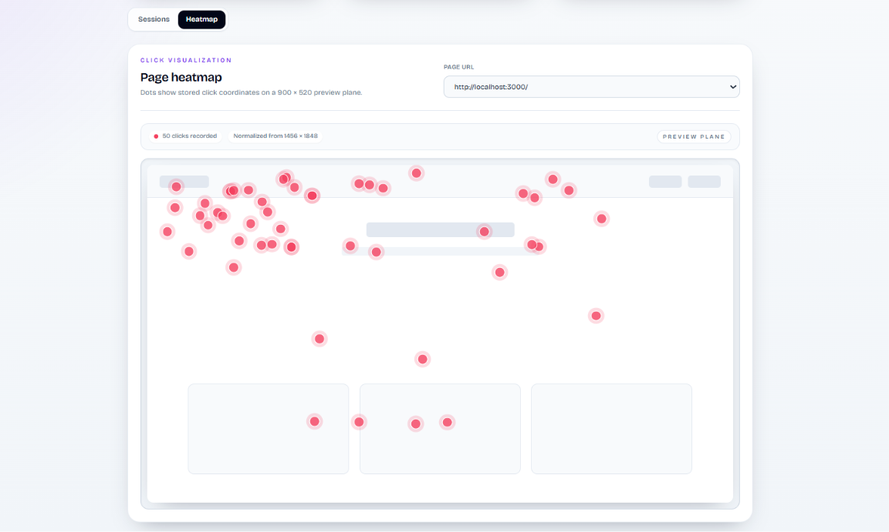

## User Analytics Dashboard

A full-stack analytics application that captures page views and click interactions, stores them in MongoDB, and visualizes user behavior through session timelines and click heatmaps.

---
## Features

### Event Tracking

* Tracks `page_view` and `click` events
* Generates and persists a session ID using `localStorage`
* Captures page URL, timestamp, and click coordinates
* Sends events to the backend in real time

### Analytics Dashboard

* View all tracked sessions with event counts
* Sessions ordered by latest activity
* Inspect complete user journeys for individual sessions
* Visualize click activity through a heatmap interface
* Select page URLs and explore interaction hotspots

### Backend & Database

* MongoDB event storage
* Session aggregation APIs
* User journey APIs
* Heatmap APIs
* Indexed event schema for efficient querying

---

## Tech Stack

* Next.js 15 (App Router)
* React 19
* TypeScript
* Tailwind CSS
* MongoDB Atlas
* Mongoose

---

## Architecture

```text
Browser
   │
   ▼
tracker.js
   │
POST /api/track
   │
   ▼
MongoDB (events)
   │
   ├── /api/sessions
   ├── /api/events/[sessionId]
   └── /api/heatmap
   │
   ▼
Analytics Dashboard
```

---

## Key Design Decisions

### Session Identification

Sessions are generated client-side using a UUID stored in `localStorage`, allowing user journeys to be reconstructed without requiring authentication.

### Single Event Collection

All analytics events are stored in a single MongoDB collection, simplifying ingestion and querying.

### Heatmap Aggregation

Heatmaps aggregate click activity across all sessions for a selected page, similar to common product analytics workflows.

### Latest Activity Ordering

Sessions are ordered by their most recent event timestamp, making active users easier to inspect.

---

## API Endpoints

| Method | Endpoint                   | Description                               |
| ------ | -------------------------- | ----------------------------------------- |
| POST   | `/api/track`               | Store analytics events                    |
| GET    | `/api/sessions`            | Retrieve sessions with event counts       |
| GET    | `/api/events/[sessionId]`  | Retrieve ordered session events           |
| GET    | `/api/heatmap?pageUrl=...` | Retrieve click data for heatmap rendering |

---

## Environment Variables

Create a `.env.local` file:

```env
MONGODB_URI=your_mongodb_connection_string
```

---

## Running Locally

```bash
npm install
npm run dev
```

Open:

```text
http://localhost:3000
```

Dashboard:

```text
http://localhost:3000/dashboard
```

---

## Assumptions & Trade-offs

* Session identity is stored in browser `localStorage`.
* Events are sent immediately rather than batched.
* Clicks are captured globally at the document level.
* Heatmaps are generated from recorded click coordinates.
* Authentication is intentionally omitted to keep the focus on analytics functionality.

---

## Future Improvements

* Event batching to reduce network overhead
* Date range and event-type filtering
* Session replay functionality
* Real-time analytics updates
* Viewport-aware heatmap rendering
* Authentication and access control

---


---

## License

This project was created as part of a technical assessment.